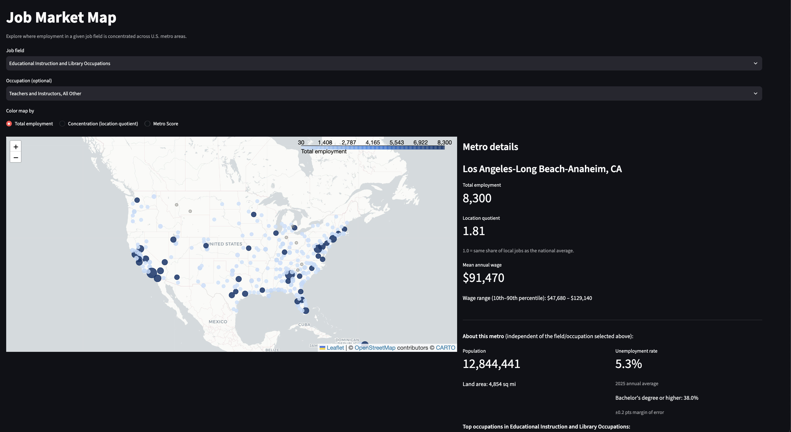
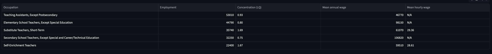
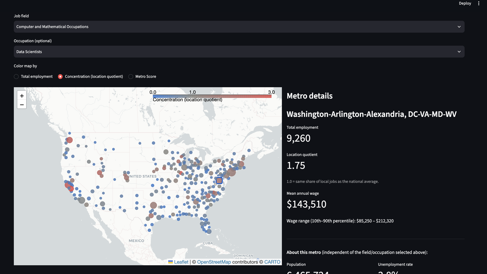
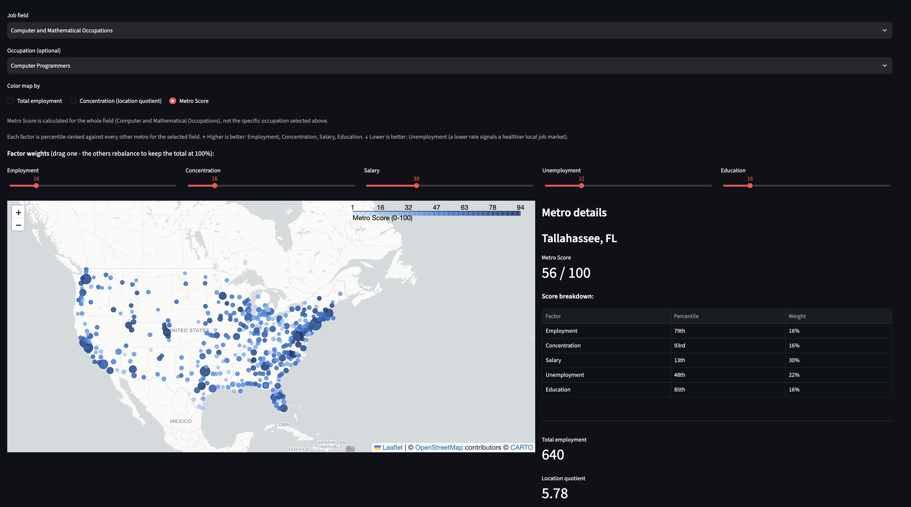

# Job Market Map

I built an interactive dashboard for exploring U.S. employment data by metro area
and job field. This dashboard is built to help someone (a student or a job-seeker) see where opportunities in a given field are concentrated, what they pay, and what the local labor market looks like there. Using sizes and colors, this map gives a quick snapshot of what each metro area looks like for employment in specific fields.

## Features

- **Interactive map** - 393 U.S. metro areas, color-coded by:
  - Total employment in a selected job field. This section shows color by total employment of an area. You can select 1 of 22 distinct job classifications (eg. "Computer and Mathematical Occupations"), and then narrow your search down even more by selecting a specific occupation (e.g. "Software Developers"). Here we are looking at Educational Instruction and Library Occupations, narrowed down to Teachers and Instructors in Los Angeles-Long Beach-Anaheim, CA. 
  

  You can also view a table of the top occupations in that category in that metro area in a table format:
   

  - Concentration (location quotient) — how over- or under-represented a
    field is in a metro compared to the national average (1.0 = same share
    as the national average).

    

    In this example, Data Scientists have a location quotient of
    1.75 in Washington-Arlington-Alexandria, meaning
    this metro has 75% more of its local jobs in data science than the
    national average, which makes sense with the region's concentration of
    tech, consulting, and federal data work.

  - **Metro Score** — a composite 0–100 score blending employment,
    concentration, salary, unemployment, and education, with user-adjustable
    weights (see below)
    

    Within this metro, we can see what percentile Tallahassee falls into for each of the 5 factors.

## Tech stack

- **App**: [Streamlit](https://streamlit.io/)
- **Map**: [Folium](https://python-visualization.github.io/folium/) /
  Leaflet: `streamlit-folium`
- **Database**: SQLite, SQLAlchemy
- **Data processing**: Python (pandas)

## Data sources

| Source | What it provides |
|---|---|
| [BLS OEWS](https://www.bls.gov/oes/) | Employment counts, wages, and location quotient by detailed occupation, at the metro-area level |
| [Census Gazetteer Files](https://www.census.gov/geographies/reference-files/time-series/geo/gazetteer-files.html) | Metro area land area and centroid coordinates |
| [Census Population Estimates Program](https://www.census.gov/programs-surveys/popest.html) | Metro area population |
| [BLS Local Area Unemployment Statistics](https://www.bls.gov/lau/) (from[FRED](https://fred.stlouisfed.org/)) | Metro area unemployment rate |
| [Census American Community Survey](https://www.census.gov/programs-surveys/acs) (5-year estimates) | Educational attainment (% with a bachelor's degree or higher) |

## How it works

I used three normalized SQLite tables:

- **`msa`** — one row per metro area (name, land area, lat/lon, population,
  unemployment rate, educational attainment)
- **`occupation`** — one row per SOC occupation code, at either the
  "major group" (22 broad fields) or "detailed" (824 specific occupations)
  level
- **`employment`** — one row per (metro, occupation) pair: employment
  count, wages, location quotient

`scripts/load_data.py` builds this database from the raw data files in
`data/raw/` (not committed — see Setup below). `app.py` is a Streamlit app
that queries this database directly with parameterized SQL.

## Setup

**This project isn't yet a one-command setup** — see Limitations below.
Currently the process is a bit more detailed:

1. Clone the repo, create a virtual environment, and install dependencies:
   ```
   python3 -m venv venv
   source venv/bin/activate
   pip install -r requirements.txt
   ```

2. Download the raw data files into `data/raw/`:
   - **OEWS**: from [bls.gov/oes/tables.htm](https://www.bls.gov/oes/tables.htm),
     download the most recent "Metropolitan and Nonmetropolitan Area"
     Excel file, save as `data/raw/MSA_M2025_dl.xlsx`. 
   - **Gazetteer**: download and unzip
     [this file](https://www2.census.gov/geo/docs/maps-data/data/gazetteer/2025_Gazetteer/2025_Gaz_cbsa_national.zip)
     into `data/raw/`.
   - **Population**: download
     [this file](https://www2.census.gov/programs-surveys/popest/datasets/2020-2025/metro/totals/cbsa-est2025-alldata.csv)
     into `data/raw/`.

3. Get two free API keys and put them in a `.env` file in the project root:
   - [FRED API key](https://fred.stlouisfed.org/docs/api/api_key.html)
   - [Census API key](https://api.census.gov/data/key_signup.html)
   ```
   FRED_API_KEY=your_key_here
   CENSUS_API_KEY=your_key_here
   ```

4. Fetch unemployment and education data, then build the database:
   ```
   python scripts/fetch_unemployment.py
   python scripts/fetch_education.py
   python scripts/load_data.py
   ```

5. Run the app:
   ```
   streamlit run app.py
   ```

## Limitations (and what's next)

- **Not deployed — only runs locally.** The app depends on a local `.env`
  file holding two personal API keys, and there's no public hosted version
  yet. Deploying this is the next thing  to fix.
- **Map markers, not real metro boundaries.** Metros are shown as
  circles sized/colored by the selected metric, not as their actual
  geographic shape — a deliberate simplification to ship an early working
  version rather than block on shapefile work.
- **Single point-in-time snapshot**, not a trend over time — there's no
  multi-year data, so the dashboard can't show whether a field is growing
  or shrinking in a given metro, only its current state.
- **Metro Score is scoped to what's already in the database** (OEWS +
  unemployment + education). In the future I hope to encompass more data in a cleaner way, including categories like cost of living, crime, or healthcare access, each of which is its own separate data-sourcing effort.

## What's Next

The first step I will take will be to make this project deployed and executable with one command. I hope to make it easily accessible to people who are curious about this data in the job market.